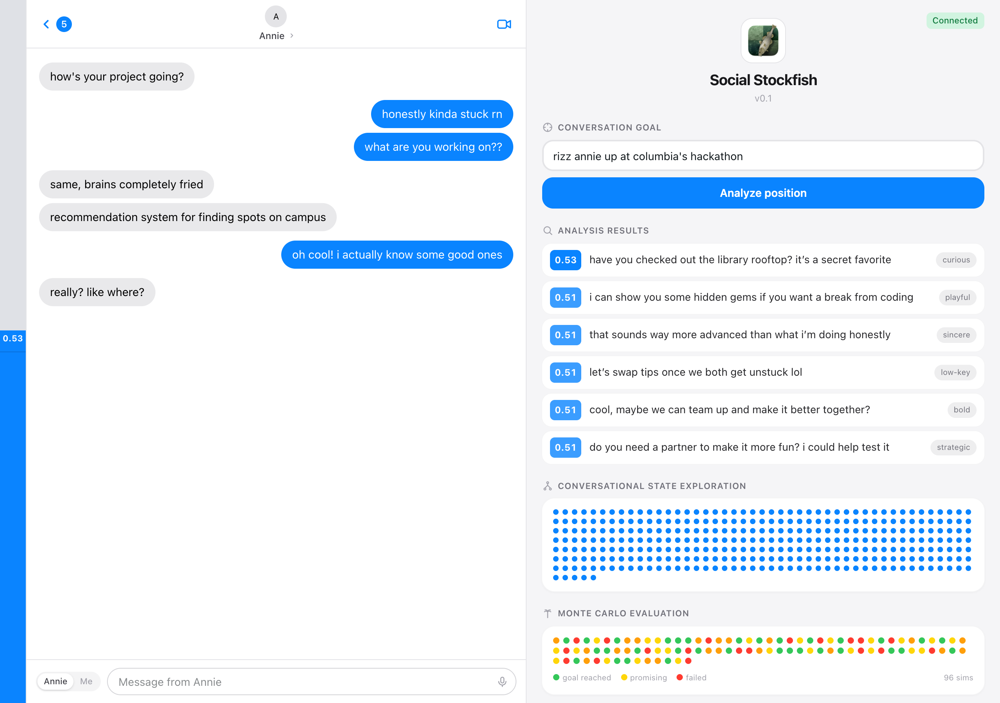

# Social Stockfish

> Stockfish, but for conversations. Give it your chat history and a goal, and it
> looks several moves ahead — generating candidate replies, self-playing the
> conversation tree, and running Monte Carlo rollouts scored by an LLM value
> function — to tell you the highest-expected-value thing to say next.

Live: **https://chat.lulzx.space**



## How it works

Like the chess engine, it doesn't try to "think like a human" — it calculates.
The engine (`backend/engine.py`) runs, per analysis:

1. **Candidate generation** — the candidate model (Groq `qwen/qwen3-32b`) reads the
   transcript + goal, infers a persona model of the other person, and streams a
   *list* of ~6 strong, strategically diverse candidate opening moves (JSONL, one
   per line, so they appear live).
2. **Monte Carlo rollouts** — the moment a candidate streams in, its rollouts are
   dispatched (pipelined). The rollout model (Groq `llama-3.1-8b-instant`)
   self-plays the conversation ~5 moves ahead (a "ME" model vs a "THEM" model),
   sampling realistic uncertainty, and a value function scores each full path 0–1
   on goal achievement — streamed one number per line so the dot grids fill live.
3. **Ranking** — the mean rollout score is the candidate's probability-weighted
   **expected value**; the moves are ranked into the ANALYSIS RESULTS panel and the
   best score drives the Stockfish-style eval bar.

The naive version of this idea (the original viral demo) fanned out one API call
per tree node — hundreds of calls per run, rate-limit hell. This implementation
collapses the whole tree into **a handful of streaming requests that each return
lists**, so a full analysis runs in **~1–2 seconds**. A token-bucket rate limiter
+ bounded concurrency + 429 backoff in `backend/llm.py` keep it within provider
limits *always*. Em dashes are stripped from generated replies.

## Stack

- **Backend** — FastAPI + WebSocket streaming; a generic OpenAI-compatible async
  client (`backend/llm.py`, pointed at Groq). Streams `persona` → `candidate` →
  `rollout` → `results` events so the UI fills in real time.
- **Frontend** — React 19 + Vite + **HeroUI** (Tailwind v4). Full-bleed two-pane
  layout: iMessage-style chat on the left (editable contact name, per-message
  sender toggle), the analysis engine on the right with animated
  state-exploration and Monte Carlo dot grids, and a Stockfish-style eval bar.
  Analysis runs on demand via the **Analyze position** button.

## Run locally

```bash
# backend
cd backend
python3 -m venv .venv && .venv/bin/pip install -r requirements.txt
cp .env.example .env          # then add your Groq API key (https://console.groq.com)
.venv/bin/uvicorn main:app --port 8000

# frontend (separate terminal) — proxies /ws and /health to :8000
cd frontend
npm install
npm run dev                   # http://localhost:5173
```

Quick engine smoke test (no UI): `cd backend && .venv/bin/python test_engine.py`

## Configuration (`backend/.env` — see `.env.example`)

| var | default | meaning |
|---|---|---|
| `LLM_API_KEY` | — | Groq API key (or any OpenAI-compatible provider) |
| `LLM_BASE_URL` | `https://api.groq.com/openai/v1` | provider base URL |
| `CANDIDATE_MODEL` | `qwen/qwen3-32b` | model for candidate generation |
| `ROLLOUT_MODEL` | `llama-3.1-8b-instant` | model for rollout scoring |
| `CANDIDATE_REASONING` / `ROLLOUT_REASONING` | `none` / — | `reasoning_effort` per model |
| `CANDIDATES` | 6 | candidate moves per analysis |
| `ROLLOUTS_PER_CANDIDATE` | 16 | Monte Carlo samples per move |
| `MAX_RPM` / `MAX_CONCURRENCY` | 200 / 8 | rate-limit guardrails |

The client is provider-agnostic — point `LLM_BASE_URL`/`*_MODEL` at any
OpenAI-compatible API (MiniMax-M3, OpenAI, etc.); see `.env.example` for a
MiniMax example.

## Deployment

The built SPA is copied to `backend/static/` and served by FastAPI alongside
`/ws`. On the VPS it runs as the `social-stockfish` systemd unit on
`127.0.0.1:8201`, reverse-proxied by Caddy (`chat.lulzx.space`, automatic HTTPS).
DNS is a DNS-only A record on Cloudflare → the VPS.

## License

MIT
